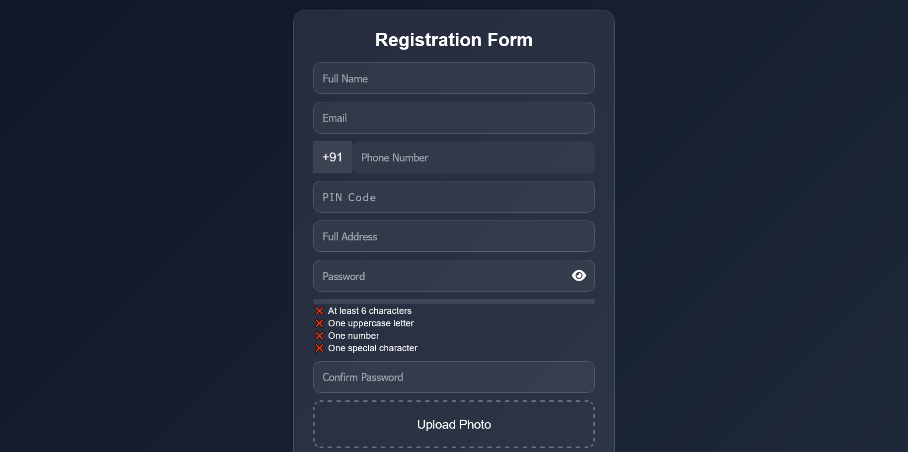

# 💎 Advanced Registration Form (Glassmorphism UI)

A modern **User Registration System** built using HTML, CSS, and JavaScript with real-time validation, password strength meter, image upload, and localStorage support.

---

## 🌐 Live Demo
👉 https://vikaspawar-dev.github.io/user-registration-system/

---

## 📸 Screenshot

---

## ✨ Features

- 🔐 Real-time form validation
- 👁 Password show/hide toggle
- 🔥 Password strength meter
- ✔ Password requirement checklist
- 📷 Image upload + preview
- 📍 PIN Code field support
- 📱 Responsive design
- 💾 LocalStorage data saving
- 📄 Result page display

---

## 🧠 Pages

- `index.html` → Registration Form
- `result.html` → Display saved users
- `script.js` → Form logic + validation
- `result.js` → Show stored data
- `style.css` → Glassmorphism UI design

---

## 🛠️ Tech Stack

- HTML5
- CSS3 (Glassmorphism + Animations)
- JavaScript (ES6)
- LocalStorage API

---

## 🚀 How It Works

1. User fills registration form  
2. JavaScript validates all inputs  
3. Password strength + checklist updates live  
4. Image preview is shown  
5. Data is saved in LocalStorage  
6. Redirects to result page  
7. All users are displayed dynamically  

---

## 📂 Project Structure
📁 advanced-registration-form
│── index.html
│── result.html
│── script.js
│── result.js
│── style.css
│── README.md
│── Screenshot Registration Form.png

---

## 💡 Future Improvements

- 🔐 OTP Verification system
- 🌍 Google Maps integration for address
- 🔍 Search users feature
- ✏ Edit / Delete user system
- 🔥 Firebase backend integration

---

## 👨‍💻 Author

**Vikas Pawar**  
Frontend Developer (Learning → Advanced Projects)

---

## ⭐ Support

If you like this project:
- ⭐ Star the repo  
- 🍴 Fork it  
- 📢 Share it  

---
